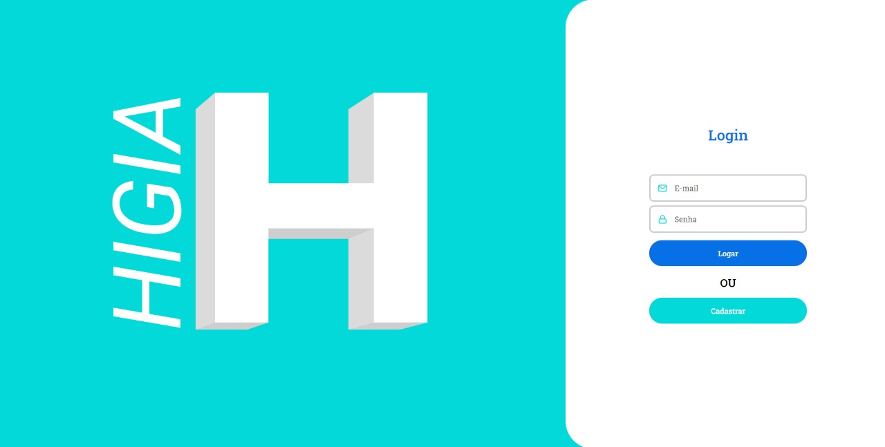

<div align="center" style="margin-bottom: 20px;">

</div>


[](http://github.com/engcfraposo/Higia-WEB/LICENSE.md)

[](https://www.codacy.com/manual/engcfraposo/Higia-WEB_2?utm_source=github.com&amp;utm_medium=referral&amp;utm_content=engcfraposo/jst-job-challenges-frontend&amp;utm_campaign=Badge_Grade)

<a href="https://github.com/engcfraposo/Higia-WEB/stargazers">
    
  </a>


<p align="center" >
  <a href="#fire-prévia-da-aplicação"> :fire: Prévia da Aplicação</a> |
  <a href="#rocket-tecnologias-usadas"> :rocket: Tecnologias Usadas</a> |
  <a href="#hammer-deploy-da-aplicação"> :hammer: Deploy da Aplicação</a> |
  <a href="#thinking-como-contribuir?"> :thinking: Como Contribuir?</a> |
  <a href="#zap-executando-o-projeto"> :zap: Executando o Projeto </a> |
</p>

</div>

## :barber: O projeto

Plataforma que visa unir recém-formados em
psicologia a pacientes, de modo a prover
atendimento psicológico nos momentos de crise
às pessoas que não têm condições para pagar os
atendimentos;

## :fire: Prévia da Aplicação

<div align="center" style="margin: 20px;">

 
</div>

### :rocket: Tecnologias Usadas

O projeto foi feito com as seguintes tecnologias:

- [ReactJS](https://pt-br.reactjs.org/)
- [Styled-Components](https://styled-components.com/)
{...}

## :thinking: Como Contribuir?
**Faça um fork deste repositório**

```bash
# Clone o seu fork
$ git clone url-do-seu-fork && cd Higia-WEB

# Crie uma branch com sua feature ou correção de bugs
$ git checkout -b minha-branch

# Faça o commit das suas alterações
$ git commit -m 'feature/bugfix: minhas alterações'

# Faça o push para a sua branch
$ git push origin minha-branch
```

Depois que o merge da sua pull request for feito, você pode deletar a sua branch.

## :zap: Executando o Projeto
#### Clonando o projeto
```sh
$ git clone https://github.com/engcfraposo/Higia-WEB.git
$ cd Higia-WEB
```

#### Iniciando o Frontend
```sh
$ npm start
```

### :memo: Licença

Este projeto é desenvolvido sob a licença MIT. Veja o arquivo [LICENSE](LICENSE.md) para saber mais detalhes.

<p align="center" style="margin-top: 20px; border-top: 1px solid #eee; padding-top: 20px;">Feito com :purple_heart: by <strong> Olimpo </strong> </p>
